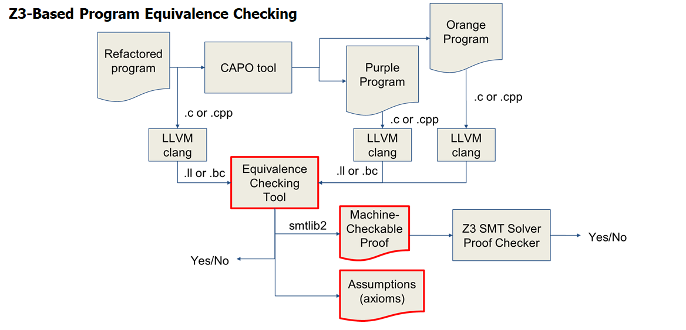

# Partitioner Translation Validator (ParTV)


This tool verifies the equivalence between the refactored program and
those in the various enclaves by checking, function-by-function, that
the generated code has been paritioned without undue modification and
will thus behave like the refactored code.  The tool, written in
[Haskell](https://www.haskell.org/), loads both programs then starts
establishing their equivalence.  As it proceeds, it construct a
modular, bottom-up proof in the
[Z3](https://github.com/Z3Prover/z3/wiki) theorem prover that is both
checked as the tool proceeds and written out in
[SMT-LIB](http://smtlib.cs.uiowa.edu/) format, a human- and
machine-readable format suitable for auditing.

## Building and running

ParTV has been developed under Ubuntu 20.04 x86_64 Linux. It builds
under the [Haskell Tool
Stack](https://docs.haskellstack.org/en/stable/README), which is
designed for reproducible builds by allowing the user to specify
specific versions of the compiler and libraries.

Each of the following processes succeeds on a fresh docker image of Ubuntu 20.04

#### Quickest build and run (use pre-built examples)

```
sudo apt install llvm-9 llvm-9-dev
curl -sSL https://get.haskellstack.org/ | sh
git clone https://github.com/gaps-closure/build.git
cd build/capo
git submodule update --init --recursive
cd C/ect
scripts/run_ex.sh secdesk  # proves original and refactored equivalent, outputs secdesk_proof.smt2
scripts/run_ex.sh example1 # identifies inconsistency: zero-argument function becomes vararg
```

#### Quick build and run (prepares examples from source before running)

```
sudo apt install llvm-9 llvm-9-dev clang-9 libclang-9-dev python3-pip libzmq3-dev sqlite3 libsqlite3-dev
pip3 install 'clang==9' jsonschema lark
curl -sSL https://get.haskellstack.org/ | sh
git clone https://github.com/gaps-closure/build.git
cd build/capo
git submodule update --init --recursive
cd C/ect
python3 scripts/build_ex.py secdesk
python3 scripts/build_ex.py example1
scripts/run_ex.sh secdesk
scripts/run_ex.sh example1
```

#### Adding new examples

There is a step in the above which is not automated for running the verifier
on new examples, which is copying the C source refactored program and partitioned
program into the `examples` directory repository. This need only be done once.
For a new example named `<some_example>`, the process is roughly as follows
(run from the ParTV directory):

```
mkdir -p examples/<some_example>/c
cp -r ../../../apps/<some_example>/refactored examples/<some_example>/c/refactored

cp -r ../../../apps/<some_example>/partitioned/orange examples/<some_example>/c/orange
... # copy each enclave source from partition
```

There are example-specific details that are not included above. For multi-file
projects where source files are organized hierarchically, the example must be
"flattened" such that all source files are in the same directory, because the
build scripts do not currently support clang arguments (and thus, include
directories). This flattening must always be done for the partitioned source,
since there is shared autogenerated code which does not live in any enclave
source directory (e.g. `codec.h`, `float754.h`) and should be copied to every
single enclave directory for ParTV.
